## **Test Environment**

**Application:** Photo Gallery Starter Kit 
Testing type: Manual exploratory testing  

**Browsers tested:**
\- Google Chrome
\- Mozilla Firefox
\- Microsoft Edge

**Operating system:**
\- Windows 10

##  Functional Bugs

### **F01: Social login buttons aren't functional**

**Description:** All four of the social login buttons (Facebook, Twitter, Google, GitHub) aren't functional. Clicking on any of them displays an error message: "undefined: Social login configuration not found."

**Severity:** Major  

**Priority:** High  

**Steps to reproduce:**  

1. Hover over the sun icon/logo in the left corner of the screen  
2. Click on "MENU" in the dropdown menu  
3. Click on "Login" on the overlay menu  
4. Click on any of the four Social Login buttons  
5. Observe the error message displayed below the buttons  

**Expected behavior:** Social login buttons should redirect the user to the correct login page, or they shouldn't be visible at all if they are not configured properly.

**Actual behavior:** Error message: "undefined: Social login configuration not found." on all of the four buttons

**Screenshots:** 

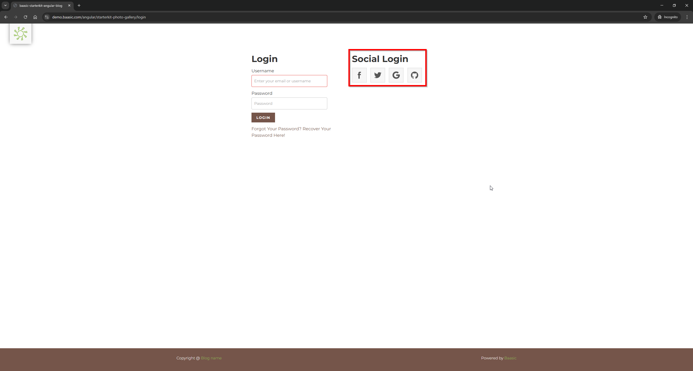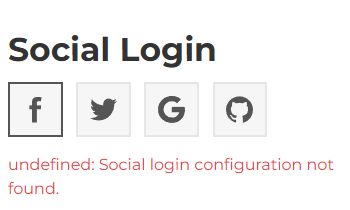

### **F02: Password Recovery - Email Validation is Too Permissive**

**Description:** The Password Recovery form accepts invalid email formats such as "a@b" without any errors. However, it rejects inputs that contain an email domain but are missing the top-level domain (for example "a@gmail."). This results in inconsistent validation, where shorter invalid emails pass validation while longer inputs that include a domain but lack the ".com", ".hr", etc. part are rejected.

**Severity:** Major 

**Priority:** High

**Steps to reproduce:**  

1. Hover over the sun icon/logo in the left corner  
2. Click on "MENU" in the dropdown menu  
3. Click on "Login" on the overlay menu  
4. Click on "Forgot Your Password? Recover Your Password Here!"  
5. Enter a value like "a@b" in the Email field  
6. Observe if any validation errors regarding email input are shown  
7. Input a value like "a@gmail." in the Email field  
8. Observe if any validation errors regarding the email input are shown  

**Expected behavior:** Email validation should reject clearly invalid email formats. Inputs like "a@b" and "a@gmail." should not be accepted.

**Actual behavior:** "a@b" passes validation with no error, while "a@gmail." which is closer to a correct input, triggers a validation error

**Screenshots:**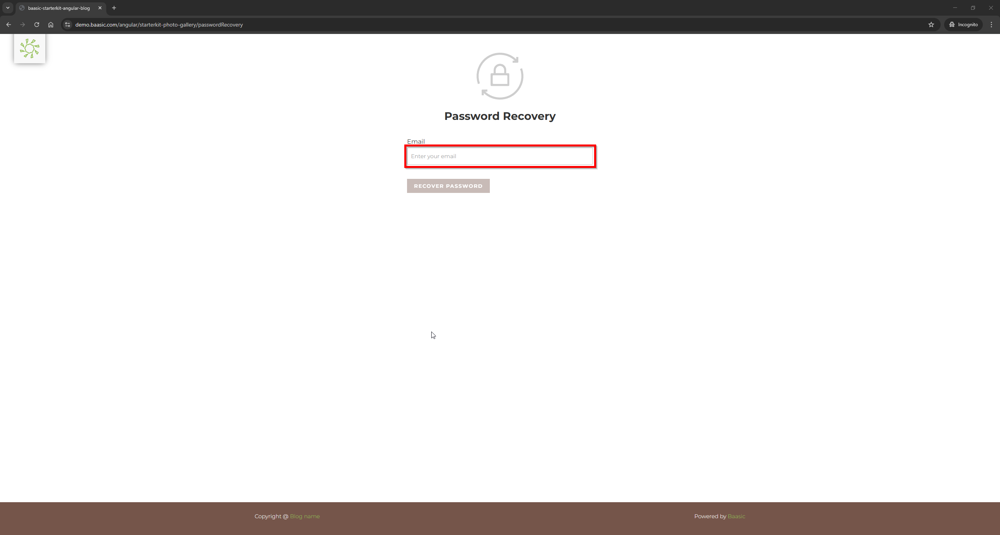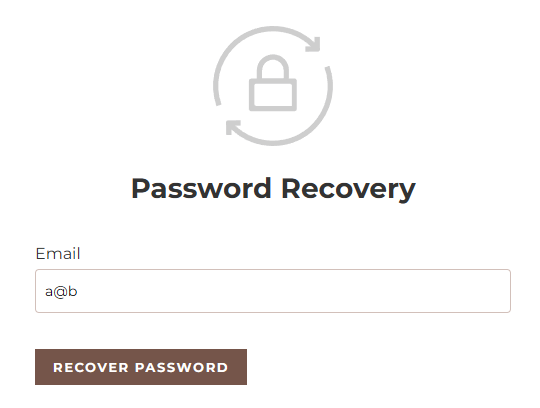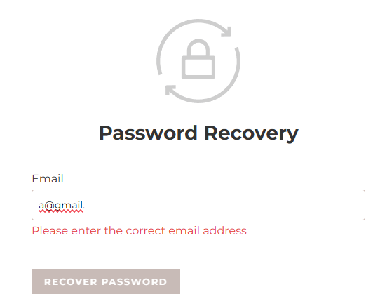

### **F03: Register form: Validation Errors remain after correct input **

**Description:** If the user clicks into all input fields on the Register form and then starts entering valid data, the validation error messages remain displayed even though the fields now contain valid inputs. This prevents the user from submitting the form despite providing correct information.

**Severity:** Major  

**Priority:** High  

**Steps to reproduce:**  

1. Hover over the sun icon/logo in the left corner  
2. Click on "MENU" in the dropdown menu  
3. Click on "Register" in the overlay menu  
4. Click into each input field once without entering any data  
5. Observe that validation errors appear under the fields  
6. Return to the fields and enter valid information  
7. Observe that the error messages remain displayed  

**Expected behavior:** Validation errors should disappear once valid data is entered into the fields.

**Actual behavior:** Error messages remain displayed even after valid inputs are entered, preventing the user from submitting the form.

**Screenshots:**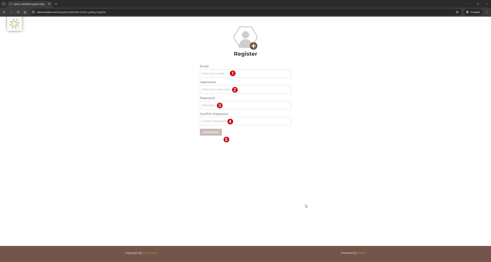

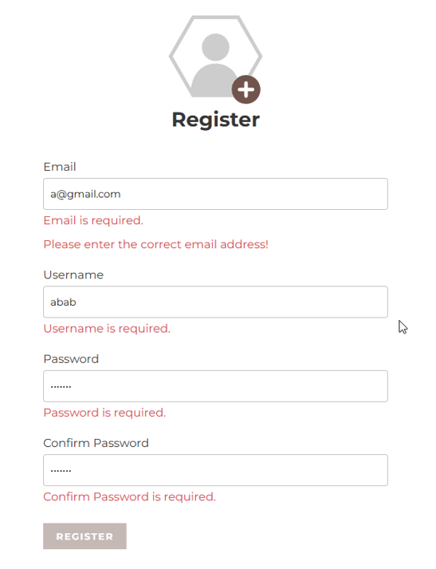

### **F04: Register Form - Email Validation is Too Permissive**

**Description:** The Register form accepts invalid email formats such as "a@b" without showing any validation errors, but rejects inputs like "a@gmail.". This results in inconsistent email validation behavior.

**Severity:** Major 

**Priority:** High  

**Steps to reproduce:**   

1. Hover over the sun icon/logo in the left corner  
2. Click on "MENU" in the dropdown menu  
3. Click on "Register" on the overlay menu  
4. Enter a value like "a@b" in the Email field  
5. Observe if any validation errors regarding email format are shown  
6. Input a value like "a@gmail." in the Email field  
7. Observe if any validation errors regarding the email format are shown  

**Expected behavior:** Email validation should reject clearly invalid email formats. Inputs like "a@b" and "a@gmail." should not be accepted.

**Actual behavior:** "a@b" passes validation with no error, while "a@gmail." which is closer to a correct input, triggers a validation error

**Screenshots:**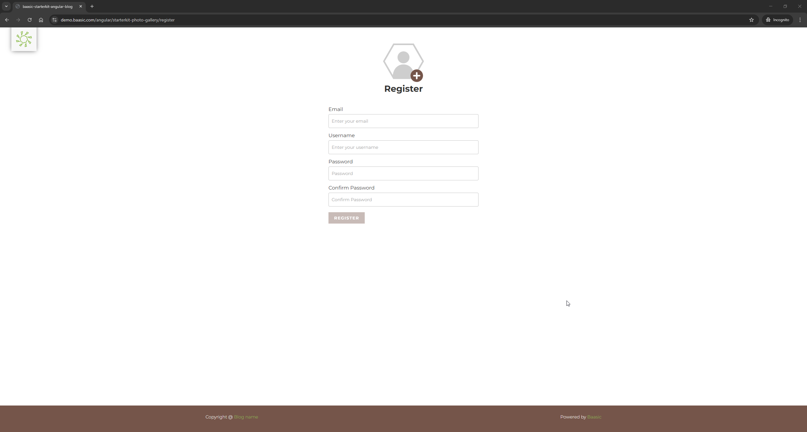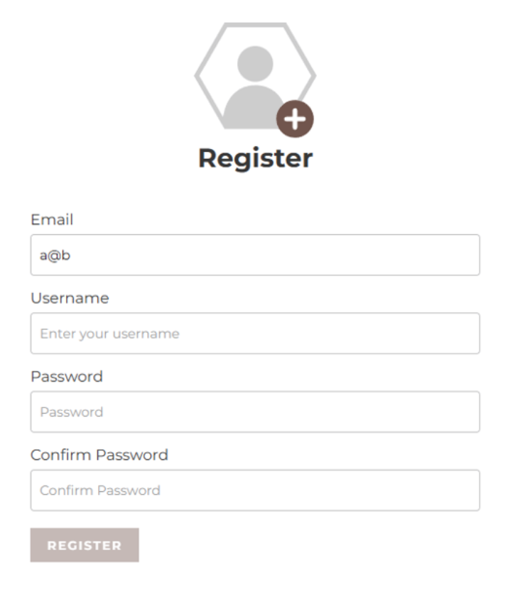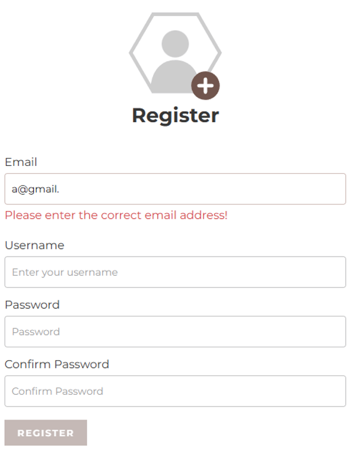

### **F05: Closing a photo returns user to homepage instead of gallery position**

**Description:** When user opens a photo from the Photo Gallery and then closes it using the X button, the application redirects the user back to the homepage instead of returning them to the same position in the Photo Gallery where they previously were.

**Severity:** Minor 

**Priority:** Low  

**Steps to reproduce:** 

1. Click on the arrow pointing downwards underneath "We are celebrating the vastness of life" 
2. Scroll through the Photo Gallery 
3. Click on any photo to open it 
4. Click the X button to close the photo 
5. Observe where the user is redirected  

**Expected behavior:** The user should be returned to the same position in the Photo Gallery where the photo was opened.

**Actual behavior:** The user is redirected to the homepage instead of the gallery, losing their previous scroll position.

**Screenshots:**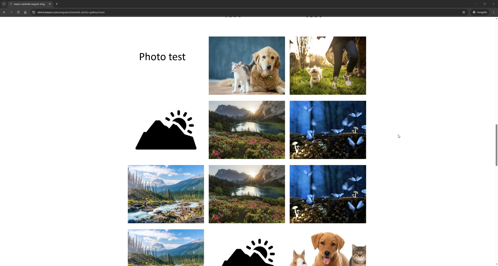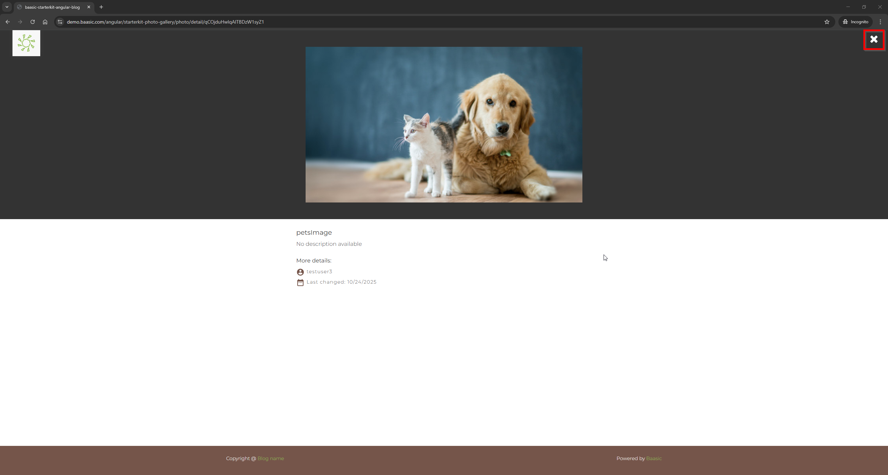

### **F06: Scrolling after resizing browser window redirects user to homepage**

**Description:** When user opens the Photo Gallery and then resizes the browser window (maximize or minimize), attempting to scroll afterward redirects the user to the homepage instead of allowing them to remain in the gallery.

**Severity:** Minor  

**Priority:** Medium 

**Steps to reproduce:** 

1. Click on the arrow pointing downwards underneath "We are celebrating the vastness of life" 
2. Scroll down to the Photo Gallery 
3. Resize the browser window (maximize or minimize) 
4. Try scrolling up or down 
5. Observe what happens  

**Expected behavior:** Resizing the browser window should not affect gallery navigation. The user should remain in the Photo Gallery when scrolling.

**Actual behavior:** After resizing the browser window, scrolling redirects the user to the homepage.

**Screenshots:**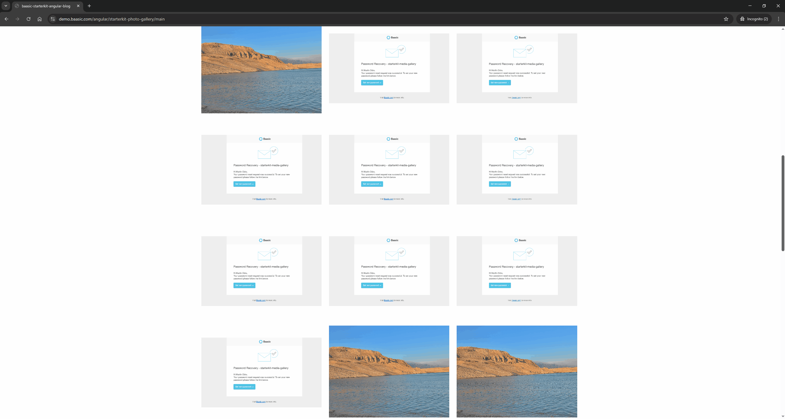

### **F07: Search results partially load and loading indicator remains active**

**Description:** When user performs a search in the Photo Gallery (for example searching for "sun" or "car"), some images appear in the results, but the loading indicator at the bottom of the screen continues spinning indefinitely. This suggests that the search results do not fully finish loading.

**Severity:** Major 

**Priority:** High  

**Steps to reproduce:**  

1. Locate the magnifying glass icon in the top-right corner of the screen 
2. Click on the icon 
3. Enter a search term (for example "sun" or "car") 
4. Observe the images that appear in the results 
5. Look at the loading indicator at the bottom of the screen  

**Expected behavior:** Search results should fully load and the loading indicator should disappear once all results are displayed.

**Actual behavior:** Some images load, but the loading indicator remains visible and continues spinning, suggesting that the results are still loading.

**Screenshots:**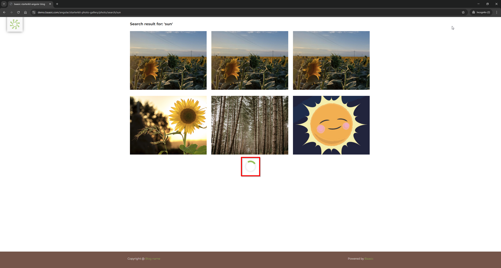

### **F08: Footer shows placeholder instead of blog name**

**Description:** The footer displays "Copyright @ Blog name" where "Blog name" is an unfilled placeholder. It is styled as a link, but clicking on it does nothing.

**Severity:** Minor 

**Priority:** Low  

**Steps to reproduce:**  

1. Scroll to the bottom of any page  
2. Observe the footer copyright text  
3. Click on "Blog name"  

**Expected behavior:** Footer should display the actual application or brand name. If displayed as a link, it should either navigate to a valid destination or not appear clickable.

**Actual behavior:** Placeholder text "Blog name" is shown and the link is not functional.

**Screenshots:**

### [AI Assisted]**F09: User cannot log in after apparent successful registration attempt**

**Description:** After submitting the registration form with valid-looking data, the user is unable to log in with the same credentials. The Login form displays a message saying that the email, username, or password are invalid. However, when trying to register again with the same username, the application displays the message "Username taken!", which suggests that the username was reserved but the created account cannot be used for login.

**Severity:** Major

**Priority:** High

**Steps to reproduce:**

1. Hover over the sun icon/logo in the left corner
2. Click on "MENU" in the dropdown menu
3. Click on "Register" in the overlay menu
4. Fill in the registration form with valid-looking data and submit it
5. Return to the Login page
6. Try logging in with the same username/email and password used during registration
7. Observe the login error message
8. Return to the Register page
9. Try registering again with the same username
10. Observe the validation message

**Expected behavior:** If the registration submission is accepted, the user should be able to log in with the same credentials. If registration is not successful, the username should not be marked as already taken.

**Actual behavior:** Login fails with a message saying that the email, username, or password are invalid, but attempting to register again with the same username shows "Username taken!".

### [AI Assisted]**F10: Password Recovery rejects email used in registration attempt as unknown user**

**Description:** When the user submits the Password Recovery form using an email address that was previously used in an apparent registration attempt, the system displays the message "Unknown user" instead of starting the password recovery process.

**Severity:** Major

**Priority:** High

**Steps to reproduce:**

1. Hover over the sun icon/logo in the left corner
2. Click on "MENU" in the dropdown menu
3. Click on "Register" in the overlay menu
4. Submit the registration form using valid-looking data
5. Hover over the sun icon/logo again
6. Click on "MENU" in the dropdown menu
7. Click on "Login" in the overlay menu
8. Click on "Forgot Your Password? Recover Your Password Here!"
9. Enter the same email address used during the registration attempt
10. Submit the Password Recovery form
11. Observe the displayed message

**Expected behavior:** If the registration submission is accepted, the application should recognize the email address and initiate the password recovery process or display a success confirmation.

**Actual behavior:** The application displays the message "Unknown user" even though the same email address was previously used during registration.

### [AI Assisted]**F11: Password Recovery displays raw "[object Object]" error message under email field**

**Description:** On the Password Recovery form, entering certain invalid email-like values causes the application to display the message "[object Object]" under the Email field instead of a clear validation or error message. The message disappears when the input field is cleared, but reappears when the user enters values that follow a basic character@character pattern, such as "a@b" or "a@gmail".

**Severity:** Major

**Priority:** High

**Steps to reproduce:**

1. Hover over the sun icon/logo in the left corner
2. Click on "MENU" in the dropdown menu
3. Click on "Login" in the overlay menu
4. Click on "Forgot Your Password? Recover Your Password Here!"
5. Enter an invalid email-like value such as "a@gmail" or another input matching the character@character pattern
6. Observe the message displayed under the Email field
7. Clear the input field
8. Enter another invalid email-like value
9. Observe the displayed message again

**Expected behavior:** The form should display a clear, user-friendly validation message explaining that the email format is invalid.

**Actual behavior:** The form displays "[object Object]" under the Email field instead of a meaningful validation or error message.

**Screenshots:**

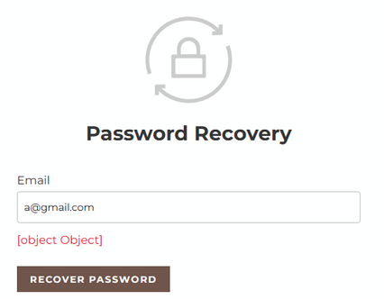

### [AI Assisted]**F12: Submitting an empty search query causes error and obscured error message**

**Description:** When the user submits the Search form without entering any search term, the application displays a white screen with an error state and a login indicator. The message "The request is invalid" appears, but it is not fully visible because it is partially covered by the sun logo/icon.

**Severity:** Major

**Priority:** High

**Steps to reproduce:**

1. Locate the magnifying glass icon in the top-right corner of the screen
2. Click on the icon
3. Leave the search input empty
4. Submit the search
5. Observe the page state and displayed message

**Expected behavior:** The application should prevent empty search submission or show a clear validation message near the search input without breaking the page layout.

**Actual behavior:** Submitting an empty search query leads to a white screen with an error state and login indicator. The message "The request is invalid" is displayed, but it is not fully visible because it appears underneath the sun logo/icon area.

**Screenshots:**

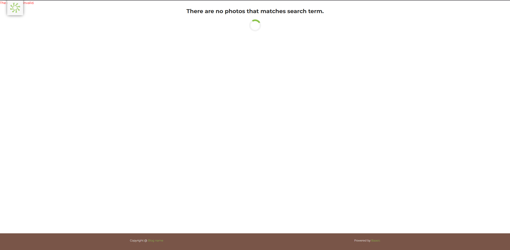

### **F13: Login and Register forms allow whitespace-only username input**

**Description:** The Login and Register forms allow the user to enter a username consisting only of empty spaces. This means the form accepts input that does not represent a valid username and does not properly validate whitespace-only values.

**Severity:** Major

**Priority:** High

**Steps to reproduce:**

1. Hover over the sun icon/logo in the left corner
2. Click on "MENU" in the dropdown menu
3. Open either the Login or Register form
4. In the Username field, enter only empty spaces
5. Fill in the remaining required fields if needed
6. Observe whether the form accepts the input or shows a validation message

**Expected behavior:** The Username field should reject values containing only whitespace and display a clear validation error.

**Actual behavior:** The form allows a username consisting only of empty spaces instead of rejecting it as invalid.

**Screenshots:**

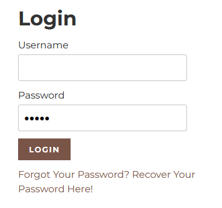

## UI/UX And Accessibility Issues

### **U01: Navigation menu is only visible on hover**

**Description:** The "Menu" navigation button appears only after hovering the sun icon/logo in the top left corner. There is no visible navigation element by default. This also affects the "Home" link, which is only accessible through this hidden menu despite being a core navigation element.

**Severity:** Minor 

**Priority:** Medium  

**Steps to reproduce:**  

1. Don't hover over anything and observe that there is no visible menu or navigation  
2. Hover over the sun icon/logo in the top left corner  
3. Observe that "Menu" appears in the dropdown  

**Expected behavior:** Navigation of the page should be visible and accessible without it requiring discovery. 

**Actual behavior:** Navigation is hidden and only appears on hover without any visual cues that it exists.

**Screenshots:**

### **U02: Input fields have poor visual focus indicator (Firefox only)**

**Description:** On multiple forms in the application, input fields provide only a barely noticeable indication that the field is focused when viewed in Firefox. The placeholder text slightly darkens when the field becomes active, but the change is minimal and difficult to notice. 

**Affected areas:**

- Login page 
- Password Recovery page 
- Register page  

**Severity:** Minor 

**Priority:** Medium  

**Steps to reproduce:**  

1. Open the application in Firefox  
2. Hover over the sun icon/logo in the top-left corner  
3. Click on "MENU" in the dropdown menu  
4. Navigate to Login, Register or Password Recovery page  
5. Click on any input field without typing  
6. Observe the visual change in the input field  

**Expected behavior:** Active/focused input field should immediately and clearly show that it is in a focused state for example by a different colored border.

**Actual behavior:** The only visual change is a barely noticeable darkening of the placeholder text when the field is active. In password fields, masking dots appear after the user starts typing. 

**Screenshots:**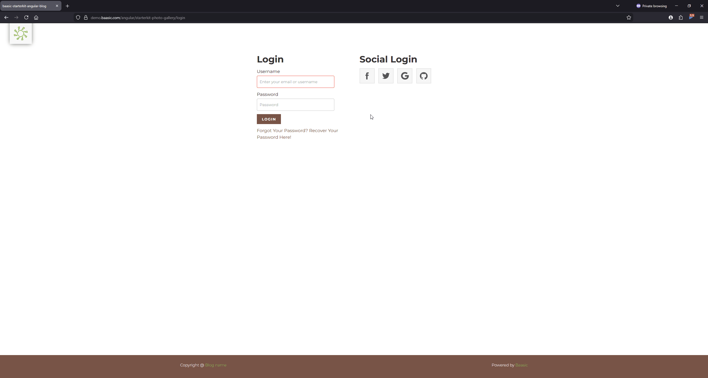

### **U03: "Forgot Password" link text wraps mid-phrase**

**Description:** The text for the "Forgot Your Password? Recover Your Password Here!" link on the Login page wraps awkwardly across lines, which reduces readability.

**Severity:** Minor 

**Priority:** Low  

**Steps to reproduce:**  

1. Hover over the sun icon/logo in the left corner of the screen  
2. Click on "MENU" in the dropdown menu  
3. Click on "Login"  
4. Observe the "Forgot Your Password? Recover Your Password Here!" below the "Login" button  

**Expected behavior:** The link text should remain readable and wrap in a clear, natural way.

**Actual behavior:** Text wraps mid-phrase.

**Screenshots:**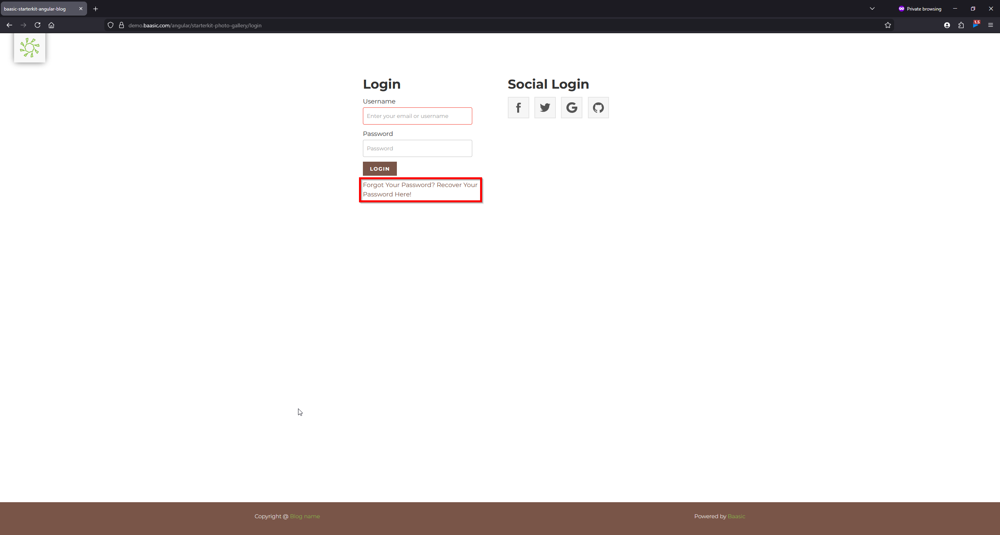

### **U04: Register form doesn't display password requirements**

**Description:** The Register form enforces a minimum password length of 7 characters *based on observed behavior*, but this is not communicated to the user before they start typing. The user receives no hints, tooltip, or checklist, only a message that the password is too short if it does not meet the minimum length of 7 characters.

**Severity:** Minor 

**Priority:** Medium  

**Steps to reproduce:**  

1. Hover over the sun icon/logo in the left corner  
2. Click on "MENU" in the dropdown menu  
3. Click on "Register" on the overlay menu  
4. Enter a password that is shorter than 7 characters  
5. Observe the error message  

**Expected behavior:** Password requirements should be clearly communicated before or during password entry.

**Actual behavior:** No password requirements are shown. The user only discovers the minimum length requirement after entering an invalid password.

**Screenshots:**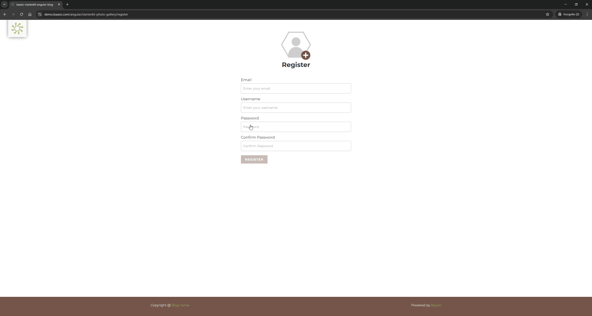

### **U05: Registration success feedback is unclear**

**Description:** After a successful registration, the application does not show a clear confirmation message. The only visible feedback is a very brief green animation on the Register button, which is so fast that it can easily look like a visual glitch rather than intentional success feedback.

**Severity:** Minor 

**Priority:** Medium  

**Steps to reproduce:** 

1. Hover over the sun icon/logo in the left corner 
2. Click on "MENU" in the dropdown menu 
3. Click on "Register" in the overlay menu 
4. Fill in all required fields with valid input 
5. Click on the "Register" button 
6. Observe what feedback is shown after successful registration  

**Expected behavior:** After successful registration, the user should receive clear and visible confirmation, such as a success message, redirect, or a noticeable success state on the form.

**Actual behavior:** No explicit success message is shown. Only a very brief green animation appears on the Register button, which is easy to miss and may look like a visual glitch rather than confirmation.

**Screenshots:**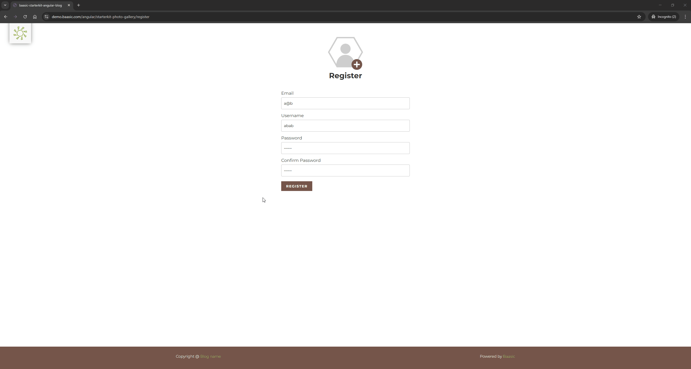

### **U06: Starting a new search query requires multiple navigation steps**

**Description:** After performing a search, there is no direct way to start a new search from the results page. The only path is to hover over the sun icon/logo in the left corner, open the "MENU" from the dropdown, and click on "Home" to be taken to the homepage and then click on the magnifying glass icon and start a new search. 

**Severity:** Minor 

**Priority:** Medium

**Steps to reproduce:**    

1. Locate the magnifying glass icon in the top-right corner of the screen  
2. Click on the icon  
3. Perform a search  
4. Observe the search results page  
5. Attempt to perform a new or different search  
6. Observe that there is no search input, clear button or modify option on the results page  

**Expected behavior:** The search results page should provide a direct way to start a new search or modify the existing query.

**Actual behavior:** There are no search controls on the results page. The user must navigate through multiple steps to access the search input again.

**Screenshots:**

### **U07: "Powered by Baasic" link opens in the same tab**

**Description:** The "Powered by Baasic" footer link opens the external Baasic website in the same browser tab, causing the user to leave the application.

**Severity:** Minor 

**Priority:** Low  

**Steps to reproduce:**  

1. Scroll to the bottom of any page  
2. Click on "Powered by Baasic"  

**Expected behavior:** External links should open in a way that does not unexpectedly remove the user from the application.

**Actual behavior:** Link opens in the same tab, navigating the user away from the application

### **U08: Footer appears with a delay when scrolling to the bottom**

**Description:** The footer does not appear immediately when the user scrolls to the bottom of the page. Instead, it becomes visible after a short delay.

**Severity:** Minor 

**Priority:** Low  

**Steps to reproduce:**  

1. Scroll down to the very bottom of the page  
2. Observe whether the footer is immediately visible or appears after a short delay  

**Expected behavior:** The footer should be rendered as part of the page layout and appear immediately when the user reaches the bottom of the page.

**Actual behavior:** The footer does not appear immediately when the user reaches the bottom of the page and becomes visible only after a short delay.

### **U09: Keyboard navigation is inconsistent and lacks clear focus indicators**

**Description:** Keyboard navigation in the application is inconsistent. Some interactive elements can be reached using the keyboard, but not all of them behave reliably or show a clear visible focus state. In addition, focused elements do not display strong outlines, frames, or other clear indicators, which makes keyboard navigation difficult to follow.

**Severity:** Major

**Priority:** High

**Steps to reproduce:**

1. Open the application
2. Use the Tab key to navigate through the page
3. Continue navigating through menu items, links, buttons, form fields, and other interactive elements
4. Track which elements respond to keyboard navigation and which do not
5. Repeat the same check across different pages and sections of the application

**Expected behavior:** All interactive elements should be reachable and usable via keyboard, and each focused element should display a clear visible focus indicator.

**Actual behavior:** Keyboard navigation is inconsistent across the application. Some elements are difficult or impossible to access using the keyboard, and focused items do not show clear visible focus indicators.